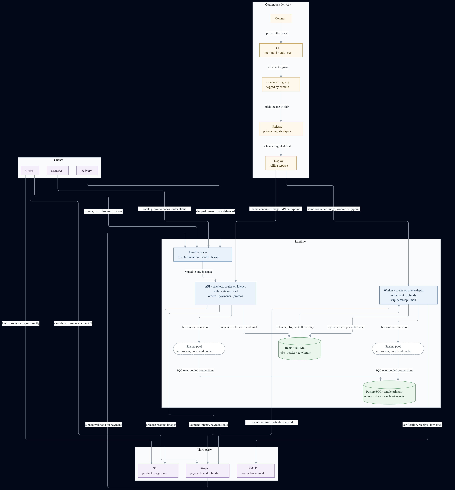

# T-Shirt Store API

A NestJS REST API for a t-shirt store: authentication with roles, product catalog
with variants and images, carts, orders and Stripe payments. Built on the ERD and
the OpenAPI contract designed in the previous weeks of the Ravn NodeJS program.

## Architecture



### Queue

- **BullMQ over the Redis already in the runtime** — retries, priorities and delayed jobs inside Nest, without adding a broker for a single service.
- **Two retry policies on purpose.** Mail: three attempts with exponential backoff, then a monitored dead-letter queue. Payment settlement: backoff until it resolves, plus an alert — there is no attempt count after which losing a payment is acceptable.
- **Redis earns its place twice**: the rate-limit counters live there too, because an in-process limiter multiplies its own limit by the number of API instances behind the load balancer.
- **The webhook is acknowledged, not settled.** The API verifies the signature, records the event and answers; the worker moves the order afterwards, so an order can read `PENDING` for a moment after its payment succeeded.
- **Checkout reserves before it charges.** Stock reservation and the `PENDING` order come first. If Stripe times out before returning a `clientSecret`, the order stays `PENDING` with no payment attempt and the repeatable sweep cancels the intent and releases the stock.

### Deployment

- **One container image, two entrypoints.** Shared build and pipeline, but each process scales on its own signal: request latency for the API, queue depth for the worker.
- **`prisma migrate deploy` runs once as a release step**, never on boot, so instances never race to migrate.
- **Expand and contract.** The compatible change ships first and the old shape is dropped in a later release — which is why a rollback is just redeploying the previous tag from the registry: Prisma has no down migrations.
- **Pooling is a constraint, not a detail.** Prisma pools inside each Node process, so there is no shared pooler and open connections grow with the number of processes, not with traffic.
- **The pool size is pinned on the database URL**, not left to Prisma's CPU-derived default, which reads the host's cores rather than the container's quota. The ceiling is PostgreSQL's `max_connections`, and it has to hold during a rolling deploy, when old and new instances are briefly up at once.

### Monitoring

Four domain alerts a generic dashboard would not catch:

- Webhook events recorded but **not settled for more than N minutes**.
- **Depth and age of the settlement dead-letter queue.**
- Orders still `PENDING` past `expires_at` — meaning **the sweep is not running**.
- `SUCCEEDED` payments on `CANCELLED` orders with no `stripe_refund_id` — **money taken and not returned**.

On the generic base underneath: error rate and p95 per route, pool saturation seen as Prisma's pool-timeout errors, queue depth and job age, and structured JSON logs with a correlation id and customer data redacted from webhook payloads.

The full write-up is in [`docs/ARQUITECTURA.md`](docs/ARQUITECTURA.md). Request-level
sequence diagrams for every flow live in [`docs/flows/`](docs/flows/).

## What is implemented

| Area | State |
|---|---|
| Authentication | Sign up, email verification, sign in, refresh rotation, sign out, password reset and change |
| Authorization | CASL abilities, policy guard, roles for client, manager and delivery |
| Catalog | Categories, products, SKUs and images, with S3-backed storage |
| Cart, orders, payments | Designed in the contract, not yet implemented |

Unit tests cover the services: **11 suites, 115 tests**.

## Requirements

- Node.js 20 or newer
- Docker, for PostgreSQL, Redis and MinIO

## Getting started

```bash
npm install
cp .env.example .env          # fill in the values
docker compose up -d          # PostgreSQL, Redis, MinIO
npx prisma migrate deploy
npm run start:dev
```

Swagger UI is served at `/docs` once the application is running.

## Testing

```bash
npm run lint
npm run build
npx jest                      # unit tests
npx jest --coverage           # with coverage
```

## Project layout

```
src/
  auth/       authentication, CASL abilities and guards
  catalog/    categories, products, SKUs and images
  common/     problem-details errors, pagination, decorators
  config/     environment validation at bootstrap
  mail/       outbound mail
  prisma/     database access
  storage/    S3-compatible object storage
  testing/    unit-test harness and factories
prisma/       schema, migrations and raw SQL notes
docs/         architecture write-up and flow diagrams
```
