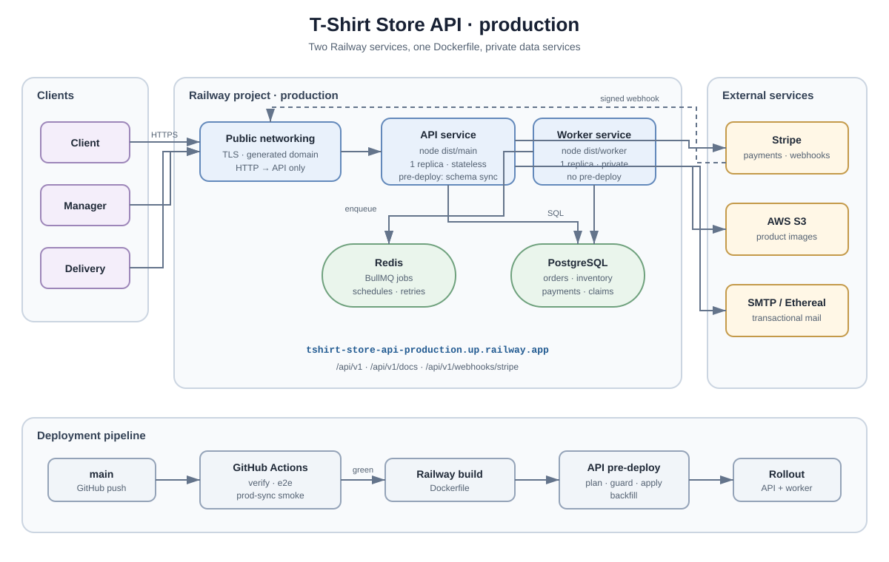

# T-Shirt Store API

A NestJS REST API for a t-shirt store: authentication with roles, product catalog
with variants and images, carts, promo codes, orders and Stripe payments. Built
on the ERD and the OpenAPI contract designed in the previous weeks of the Ravn
NodeJS program.

## Architecture



### Queue

- **BullMQ over the Redis already in the runtime** — retries, priorities and delayed jobs inside Nest, without adding a broker for a single service.
- **Retry policies that differ by what the job carries, not by house style.** Payment settlement retries with backoff for close to a day and keeps its failures indefinitely, because there is no attempt count after which losing a payment is acceptable and its payload is only a Stripe identifier. Mail gets three attempts and then **keeps nothing** — its payload holds a one-time token the database deliberately stores only the hash of, so a retained failure would be a live credential sitting in Redis. Its diagnosis is a log line carrying the recipient and the error and never the body. The sweep does not retry at all: it runs again in a minute, and a second attempt would put two sweeps over the same expired orders.
- **Rate limiting is currently process-local.** That is sufficient for the single API replica; moving its counters to Redis is required before horizontal scaling so each replica does not enforce an independent allowance.
- **The webhook is acknowledged, not settled.** The API verifies the signature, records the event and answers; the worker moves the order afterwards, so an order can read `PENDING` for a moment after its payment succeeded.
- **Checkout reserves before it charges.** Stock and an optional promo-code use are reserved with the `PENDING` order. If Stripe times out before returning a `clientSecret`, the order stays `PENDING` with no payment attempt and the repeatable sweep cancels the intent and releases both holds.

### Deployment

Production runs on Railway from `main`. Both services use the same `Dockerfile`
but Railway builds and deploys them independently:

| Railway service       | Start command      | Pre-deploy                 | Networking                |
| --------------------- | ------------------ | -------------------------- | ------------------------- |
| `tshirt-store-api`    | `node dist/main`   | `npm run prisma:sync:prod` | Public domain             |
| `tshirt-store-worker` | `node dist/worker` | None                       | Private; no public domain |

The API is currently exposed at
[`https://tshirt-store-api-production.up.railway.app`](https://tshirt-store-api-production.up.railway.app).
Its API, Swagger and Stripe webhook paths are `/api/v1`, `/api/v1/docs` and
`/api/v1/webhooks/stripe`. The generated OpenAPI document uses paths relative
to that origin, so Swagger's **Execute** button works on Railway and locally.

PostgreSQL and Redis are Railway services reached over the private network.
Both application services receive the same database, Redis, JWT, Stripe, S3
and SMTP variables; only Railway's injected `PORT` is specific to the API.
`AWS_S3_ENDPOINT` stays unset in production so the AWS SDK uses S3 rather than
the local MinIO endpoint. No credential or `.env` file belongs in Git.

The schema sync runs only on the API's pre-deploy step, never on application
boot and never on the worker. It plans the SQL with `prisma migrate diff`,
rejects destructive changes unless that one deployment explicitly enables
`ALLOW_DESTRUCTIVE_SCHEMA_CHANGE=1`, and applies the accepted plan in one
transaction. CI smoke-tests the same compiled command inside the production
image against disposable PostgreSQL before Railway can deploy it.

### Monitoring

Four domain alerts a generic dashboard would not catch:

- Webhook events recorded but **not settled for more than N minutes**.
- **Depth and age of the settlement dead-letter queue.**
- Orders still `PENDING` past `expires_at` — meaning **the sweep is not running**.
- `SUCCEEDED` payments on `CANCELLED` orders with no `stripe_refund_id` — **money taken and not returned**.

On the generic base underneath: error rate and p95 per route, pool saturation seen as Prisma's pool-timeout errors, queue depth and job age, and structured JSON logs with a correlation id and customer data redacted from webhook payloads.

The full write-up is in [`docs/ARQUITECTURA.md`](docs/ARQUITECTURA.md). Request-level
sequence diagrams for every flow live in [`docs/flows/`](docs/flows/).

## What is implemented

| Area             | State                                                                                             |
| ---------------- | ------------------------------------------------------------------------------------------------- |
| Authentication   | Sign up, email verification, sign in, refresh rotation, sign out, password reset and change       |
| Authorization    | CASL abilities, policy guard, roles for client, manager and delivery                              |
| Catalog          | Categories, products, SKUs and images, with S3-backed storage                                     |
| Cart and likes   | One active cart per client, lines added, updated and removed, and the product like                |
| Orders, payments | Checkout, order status history and Stripe webhook settlement                                      |
| Promotions       | Manager creation/list/update, client cart validation, checkout reservation and payment settlement |

The unit suite has no pending `todo` cases; CI reports the current suite and
test counts on every pull request rather than duplicating a number here that
would become stale after the next feature.

## Requirements

- Node.js 20 or newer
- Docker, for PostgreSQL, Redis and MinIO

## Getting started

```bash
npm install
cp .env.example .env          # fill in the values
docker compose up -d          # PostgreSQL, Redis, MinIO
npm run prisma:sync           # plan, guard and apply the schema, then the backfill
npm run start:dev
```

Swagger UI is served locally at `http://localhost:3010/api/v1/docs` and in
production at
[`https://tshirt-store-api-production.up.railway.app/api/v1/docs`](https://tshirt-store-api-production.up.railway.app/api/v1/docs).
The order status-history endpoint returns an ordered array of `status`,
`sequence` and ISO 8601 `occurredAt` entries; its schema is published there.

## Testing

```bash
npm run lint
npm run build
npx jest                      # unit tests
npx jest --coverage           # with coverage
npm run test:e2e              # end to end, over a real tshirt_store_test database on the compose Postgres
```

The end-to-end suite needs `docker compose up -d` first. It creates the test
database if it is missing, syncs it to `schema.prisma`, and truncates every
table before each test; it never reads `.env` or touches the development
database. Only `MailService` (which has no transport) and the rate limiter's
counters are replaced, so a test can read the one-time tokens and reset the
counters — everything else is the production wiring.

## Project layout

```
src/
  auth/         authentication, CASL abilities and guards
  catalog/      query fragments and response views shared by the four catalog modules
  categories/   categories
  common/       problem-details errors, pagination, decorators
  config/       environment validation at bootstrap
  images/       product images
  mail/         outbound mail
  prisma/       database access
  products/     products
  promo-codes/  promo-code management, validation and reservation lifecycle
  skus/         SKUs
  storage/      S3-compatible object storage
  testing/      unit-test harness and factories
prisma/         schema and the one-time live-column backfill
docs/           architecture write-up and flow diagrams
Dockerfile      production image definition with API and worker entrypoints
```
