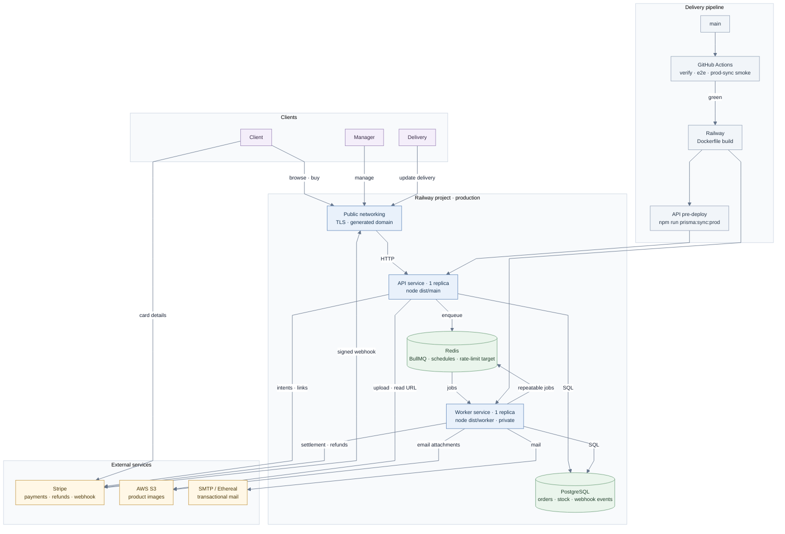

# Production architecture

The repository also contains a standalone SVG version at
[`diagram.svg`](diagram.svg) for renderers that do not execute Mermaid.

## Runtime boundaries

- **API:** authentication, authorization, catalog, carts, checkout, Stripe
  webhook verification and queue production. It is stateless apart from its
  PostgreSQL and Redis dependencies.
- **Worker:** payment settlement and refunds, expired-order sweep,
  confirmation outbox, low-stock dispatch and mail delivery. It has no HTTP
  listener and must not expose a public domain.
- **PostgreSQL:** source of truth for users, products, inventory, orders,
  payment state, webhook receipts and idempotency claims.
- **Redis/BullMQ:** durable handoff between the API and worker plus repeatable
  maintenance jobs. It is transport, not the source of truth for orders.
- **AWS S3, Stripe and SMTP:** remain outside Railway. Production leaves
  `AWS_S3_ENDPOINT` unset; local development points it at MinIO.

## Queue decisions

- The API acknowledges a valid Stripe webhook after recording and enqueueing
  it. Settlement happens asynchronously, so an order may remain `PENDING` for
  a short period after Stripe accepted the payment.
- Settlement jobs survive process restarts and retain terminal failures for
  inspection. Losing a confirmed payment after a deployment is not an
  acceptable failure mode.
- Mail gets three attempts and is removed afterwards. Its payload can contain
  a one-time token, so failed jobs must not retain usable credentials in
  Redis. Diagnostics log recipient and error, never the body or token.
- The expired-order sweep does not retry immediately; the next scheduled run
  is its retry. This avoids overlapping sweeps over the same reservations.
- Checkout reserves stock and an optional promo-code use before calling
  Stripe. The sweep releases both if the pending order expires.
- Rate-limit counters currently use the throttler's process-local storage.
  Moving them to Redis remains an operational hardening item before scaling
  the API above one replica.

## Railway deployment

Production is connected to the `main` branch. Railway waits for GitHub Actions
and builds the repository's `Dockerfile` separately for each application
service.

| Service               | Start command      | Pre-deploy command         | Public networking |
| --------------------- | ------------------ | -------------------------- | ----------------- |
| `tshirt-store-api`    | `node dist/main`   | `npm run prisma:sync:prod` | Enabled           |
| `tshirt-store-worker` | `node dist/worker` | None                       | Disabled          |

The public API domain is
`https://tshirt-store-api-production.up.railway.app`:

- API prefix: `/api/v1`
- Swagger UI: `/api/v1/docs`
- Stripe webhook: `/api/v1/webhooks/stripe`

The API and worker share the same Railway references for PostgreSQL and Redis
and the same application configuration: JWT secrets, Stripe credentials, S3
credentials, SMTP credentials and queue prefix. Railway injects `PORT` for the
API. Do not set `PORT` on the worker, and do not enable public networking for
it. Secrets and `.env` files are never committed.

The database sync belongs only to the API pre-deploy phase. Running it in both
services would race two schema plans during the same release; running it on
every boot would repeat that race on restarts and replicas. The command uses
the JavaScript compiled into `dist-deploy/`, because the production image does
not contain the `ts-node` development dependency.

`prisma/sync-schema.ts` asks `prisma migrate diff` for the SQL required to
reach `schema.prisma`, prints the plan in the deployment log and rejects
destructive statement classes by default. It then applies an accepted plan as
one transaction and runs the live-column backfill. A deliberate contract step
requires `ALLOW_DESTRUCTIVE_SCHEMA_CHANGE=1` for that deployment only, followed
by removing the override. CI's `prod-sync-smoke` job exercises this exact
compiled path against disposable PostgreSQL and checks a second run is a no-op.

Prisma owns one connection pool per Node process, so connection demand grows
with API and worker replicas. The production `DATABASE_URL` should include an
explicit `connection_limit` sized below PostgreSQL's total capacity, including
the overlap while Railway replaces old replicas.

## Monitoring

Alert on these domain failures in addition to generic error rate, latency,
memory and database-pool saturation:

- Stripe webhook events recorded but not settled after the expected delay.
- Settlement jobs retained as failed, including their age and retry count.
- Orders still `PENDING` after `expires_at`, indicating a stopped sweep.
- Successful payments on `CANCELLED` orders without `stripe_refund_id`.
- Mail processor error rate; mail queue depth is not useful because completed
  and failed mail jobs are both removed.
- Low-stock crossings with no corresponding notification job or claim.

Logs must carry correlation identifiers while excluding webhook bodies,
passwords, tokens, Stripe secrets, AWS keys and SMTP credentials.
