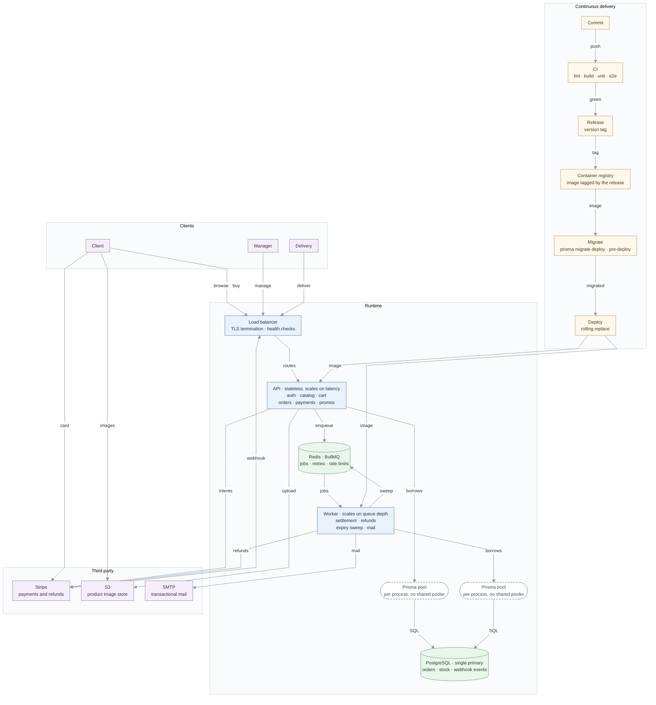

# Production architecture

## Queue

The size of the service is not the argument for BullMQ; two requirements that an
event emitter cannot meet are. Mail alone would not justify it — a resend costs
nothing and nothing else is waiting on it, so an emitter would be enough for that
job by itself.

**The expired-order sweep needs elapsed time, not an event.** An emitter only
runs when something happens — a checkout, a webhook. Nothing happens when Stripe
never answers; the order just sits `PENDING` past its `expires_at` with no event
to react to. Something has to poll the clock instead, and that is what BullMQ's
repeatable job does: on a schedule, not on a trigger, it finds every order past
`expires_at`, cancels the Stripe intent and releases the stock.

**Payment settlement has to survive a process restart.** An in-process emitter
keeps its listeners and their state in memory. A deploy, a crash or an OOM kill
between "Stripe confirmed the charge" and "the order moved to `PAID`" would drop
that handler on the floor, leaving an order `PENDING` with money already taken.
BullMQ persists the job in Redis before the handler runs, so a restart re-delivers
it instead of losing it. Its retry policy reflects that stakes: settlement retries
with backoff until it resolves and raises an alert instead of giving up, because
no number of attempts makes losing a payment acceptable. Mail's stakes are lower,
so it gets three attempts with backoff and then a monitored dead-letter queue.

The rejected alternative is `@nestjs/schedule` for the sweep plus a transactional
outbox for settlement: an `@Interval` job in place of the repeatable job, and an
`outbox` table written in the same transaction as the payment update, drained by
a poller, in place of a persisted job. It removes the Redis dependency, and it is
a legitimate design. Switching to it needs two things to be true: the team is
willing to build and operate the outbox poller and its own retry and backoff by
hand — what BullMQ gives for free today — and nothing else in the system still
wants a job runtime once that happens. Neither holds yet, so BullMQ stays. Redis
earns its place twice: the rate-limit counters live there as well, because an
in-process limiter multiplies its own limit by the number of API instances behind
the load balancer.

The API verifies the webhook signature, records the event and acknowledges it;
the worker is what moves the order afterwards, so an order can still read
`PENDING` for a moment after its payment has succeeded. Checkout creates the stock
reservation and the `PENDING` order before it calls Stripe. If Stripe times out
before returning a `clientSecret`, the order is left `PENDING` with no payment
attempt, and the repeatable sweep cancels the intent and releases the stock.

## Deployment

One container image runs both the API and the worker under different entrypoints. Build and
pipeline are shared, but each process scales on its own signal: request latency
for the API, queue depth for the worker. `prisma migrate deploy` runs once as its
own pre-deploy step, after the release is tagged and the image is built, and
never on boot, so instances never race to migrate. Schema changes
expand and contract — the compatible change ships first, the old shape is dropped
in a later release — which is why a rollback is just redeploying the previous
tag from the registry: Prisma has no down migrations.

Connection pooling is a design constraint here rather than a detail. Prisma pools
inside each Node process, so there is no shared pooler and the total number of
open connections grows with the number of processes, not with traffic. The pool
size is pinned explicitly on the database URL rather than left to Prisma's
CPU-derived default, which reads the host's cores and not the container's quota.
The ceiling to respect is PostgreSQL's `max_connections`, and it has to hold
during a rolling deploy, when old and new instances are briefly up at once.

## Monitoring

Four domain alerts, none of which a generic dashboard would catch: webhook events
recorded but not settled for more than N minutes; depth and age of the settlement
dead-letter queue; orders still `PENDING` past `expires_at`, which means the sweep
is not running; and `SUCCEEDED` payments belonging to `CANCELLED` orders with no
`stripe_refund_id`, which is money taken and not returned.

Underneath sits the generic base: error rate and p95 per route, pool saturation
seen as Prisma's pool-timeout errors, queue depth and job age, and structured JSON
logs carrying a correlation id, with customer data redacted from webhook payloads.
