# Request and worker flows

These eleven sequence diagrams cover all 38 operations in the API contract.
The `.puml` files are the editable PlantUML sources; the matching SVG files in
[`rendered/`](rendered/) are committed so GitHub and other Markdown viewers
show diagrams rather than source code.

| Flow                              | Source                                                                       | Rendered diagram                                                                    |
| --------------------------------- | ---------------------------------------------------------------------------- | ----------------------------------------------------------------------------------- |
| Sign-up and verification          | [`01-auth-signup.puml`](01-auth-signup.puml)                                 | [`01-auth-signup.svg`](rendered/01-auth-signup.svg)                                 |
| Sign-in and refresh rotation      | [`02-auth-session.puml`](02-auth-session.puml)                               | [`02-auth-session.svg`](rendered/02-auth-session.svg)                               |
| Password recovery and change      | [`03-auth-passwords.puml`](03-auth-passwords.puml)                           | [`03-auth-passwords.svg`](rendered/03-auth-passwords.svg)                           |
| Public catalog reads              | [`04-catalog-read.puml`](04-catalog-read.puml)                               | [`04-catalog-read.svg`](rendered/04-catalog-read.svg)                               |
| Catalog management                | [`05-catalog-management.puml`](05-catalog-management.puml)                   | [`05-catalog-management.svg`](rendered/05-catalog-management.svg)                   |
| Likes and low-stock notifications | [`06-like-and-stock-notification.puml`](06-like-and-stock-notification.puml) | [`06-like-and-stock-notification.svg`](rendered/06-like-and-stock-notification.svg) |
| Cart operations                   | [`07-cart.puml`](07-cart.puml)                                               | [`07-cart.svg`](rendered/07-cart.svg)                                               |
| Checkout and payment settlement   | [`08-checkout-and-payment.puml`](08-checkout-and-payment.puml)               | [`08-checkout-and-payment.svg`](rendered/08-checkout-and-payment.svg)               |
| Payment Links and guest orders    | [`09-payment-link-guest.puml`](09-payment-link-guest.puml)                   | [`09-payment-link-guest.svg`](rendered/09-payment-link-guest.svg)                   |
| Orders and status history         | [`10-orders-history-statuses.puml`](10-orders-history-statuses.puml)         | [`10-orders-history-statuses.svg`](rendered/10-orders-history-statuses.svg)         |
| Promo-code lifecycle              | [`11-promo-codes.puml`](11-promo-codes.puml)                                 | [`11-promo-codes.svg`](rendered/11-promo-codes.svg)                                 |

## Diagrams

01 · Sign-up and verification

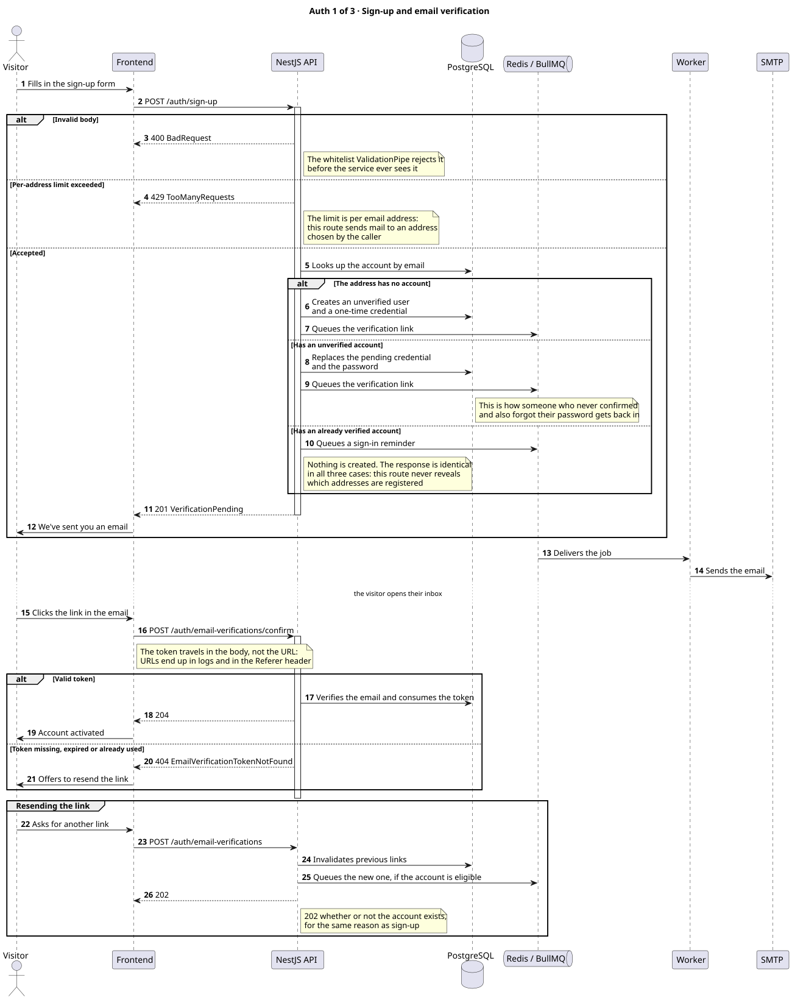

02 · Sign-in and refresh rotation

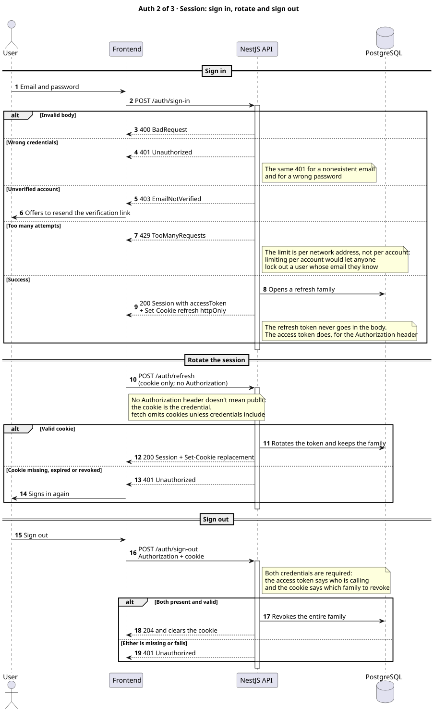

03 · Password recovery and change

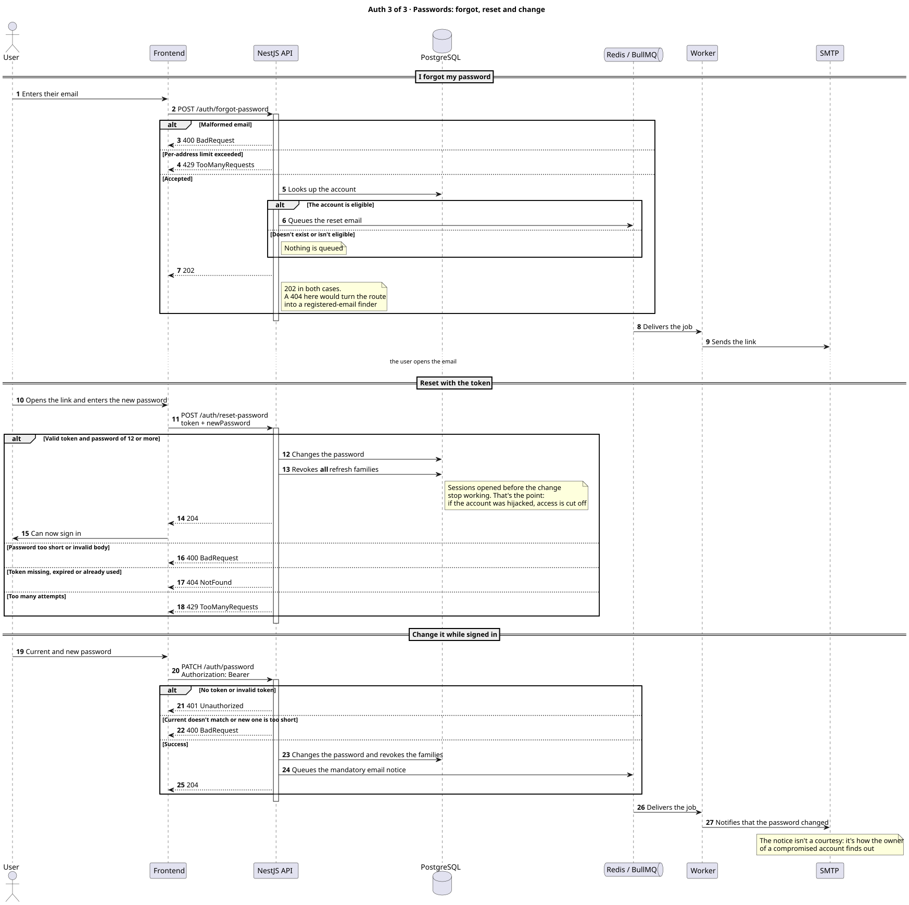

04 · Public catalog reads

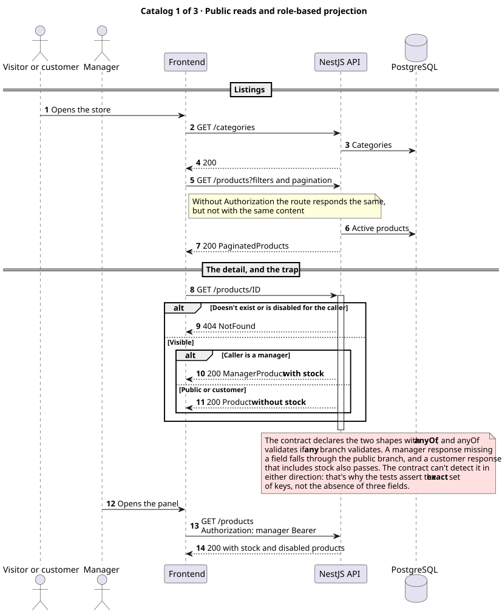

05 · Catalog management

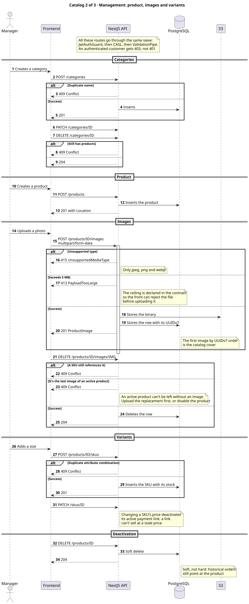

06 · Likes and low-stock notifications

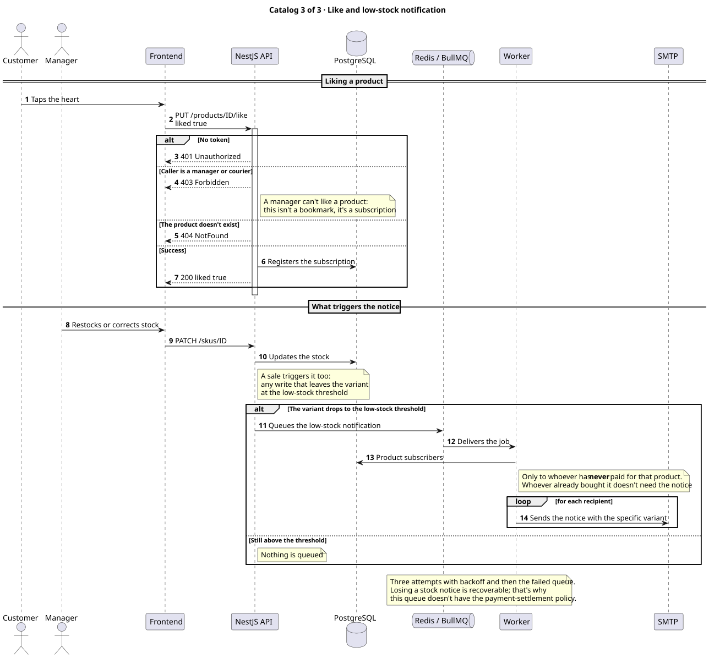

07 · Cart operations

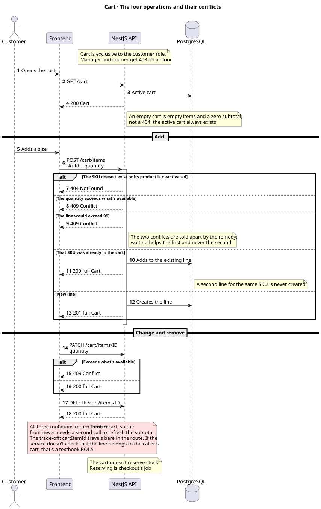

08 · Checkout and payment settlement

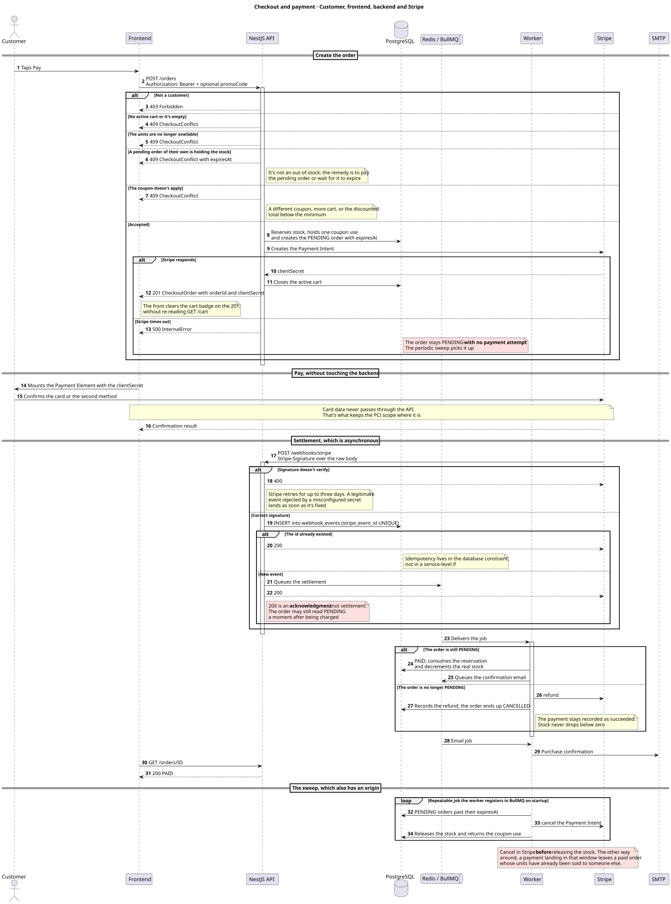

09 · Payment Links and guest orders

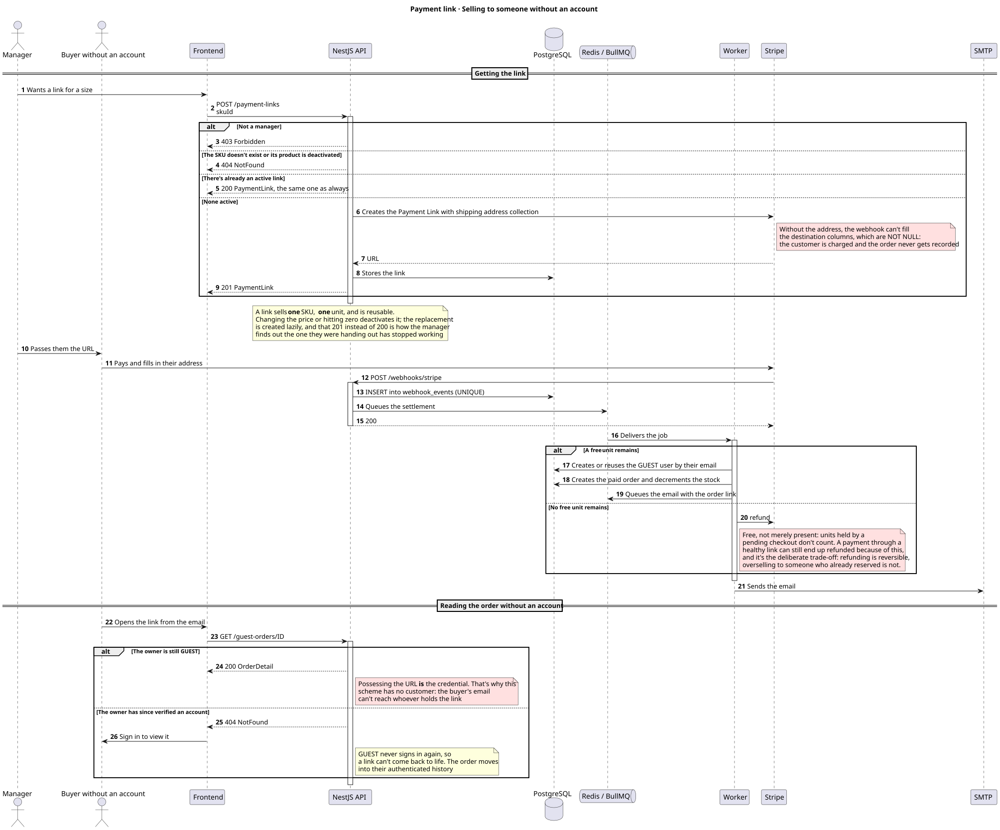

10 · Orders and status history

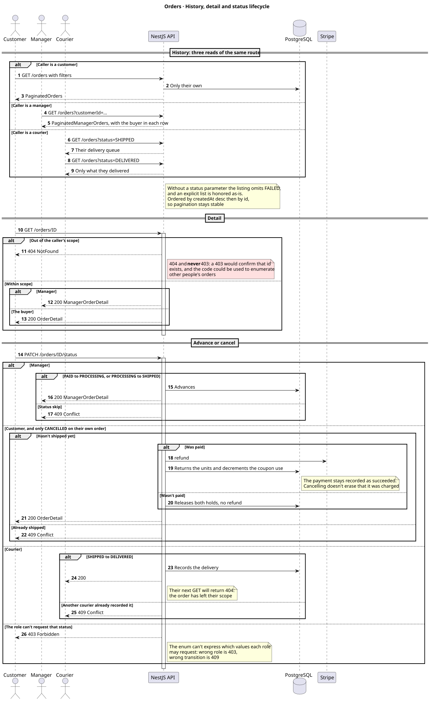

11 · Promo-code lifecycle

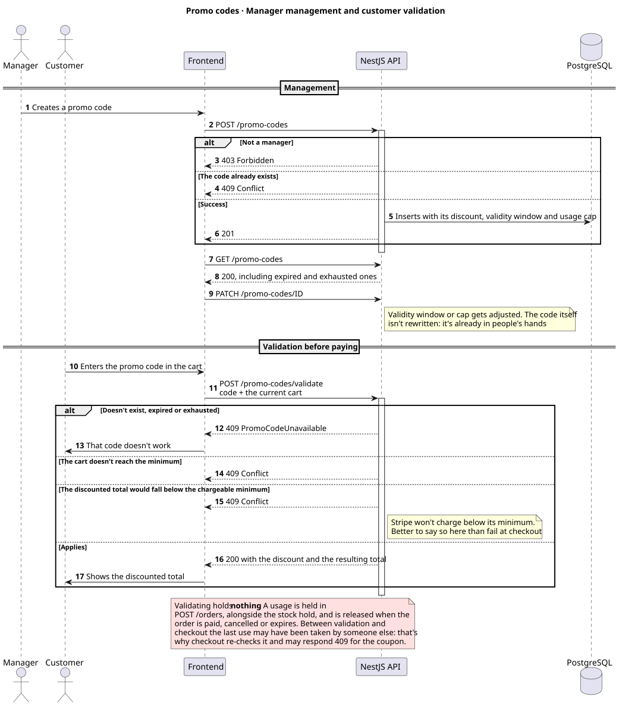

## Maintaining the diagrams

Update the `.puml` source first, render it locally to SVG and commit both files.
Do not depend on a public PlantUML server from the README: a checked-in image is
available offline, does not disclose source during rendering and cannot break
when an external service is unavailable.

With a local PlantUML CLI, run this directory's sources with SVG output directed
to `rendered/`. The checked-in files were generated locally with PlantUML's
official JavaScript engine.

Red note boxes identify security boundaries or non-obvious contracts worth
preserving: ownership checks, asynchronous webhook acknowledgement, Stripe
cancellation before releasing reservations, guest-link possession as a
credential, scoped 404 responses and promo-code revalidation at checkout.
